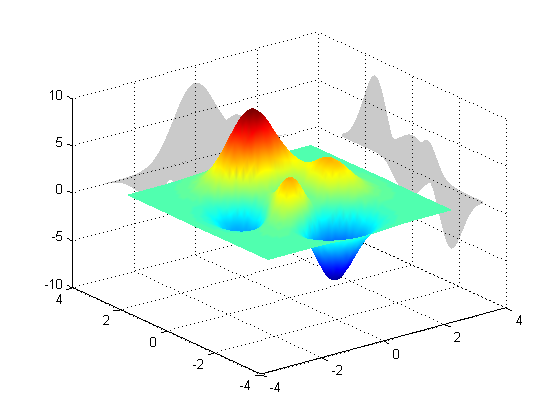

# Shadowplot
[](https://www.mathworks.com/matlabcentral/fileexchange/6400-shadowplot)
[](https://matlab.mathworks.com/open/github/v1?repo=michellehirsch/MATLAB-Shadowplot&file=ShadowplotExample.mlx&focus=true)

**SHADOWPLOT** Add a shadow to an existing surface plot

For some surface plots, it can be helpful to visualize the shadow (2D projection) of the surface. This can give a quick perspective on the data's variance.

**SHADOWPLOT PLANE** Adds a shadow plot on the **PLANE** boundary
**PLANE** can be:
x, y, or z: Plots on back/top wall of x, y or z
1 .. 6 : Plots on Nth wall, numbered as in AXIS:
[xmin xmax ymin ymax zmin zmax]

**SHADOWPLOT(HAX,PLANE)** Adds a shadow plot on the Nth wall on axes HAX

**HS = SHADOWPLOT(...)** Returns a handle to the shadow (a patch)

Examples:
```matlab
figure
surf(peaks)
shading interp
shadowplot x % Back X Wall
shadowplot y % Back Y Wall
```



